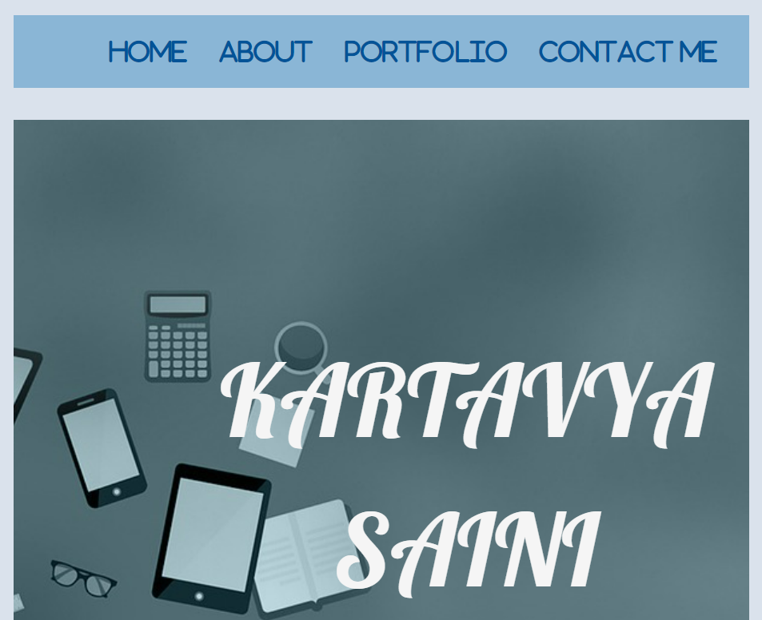
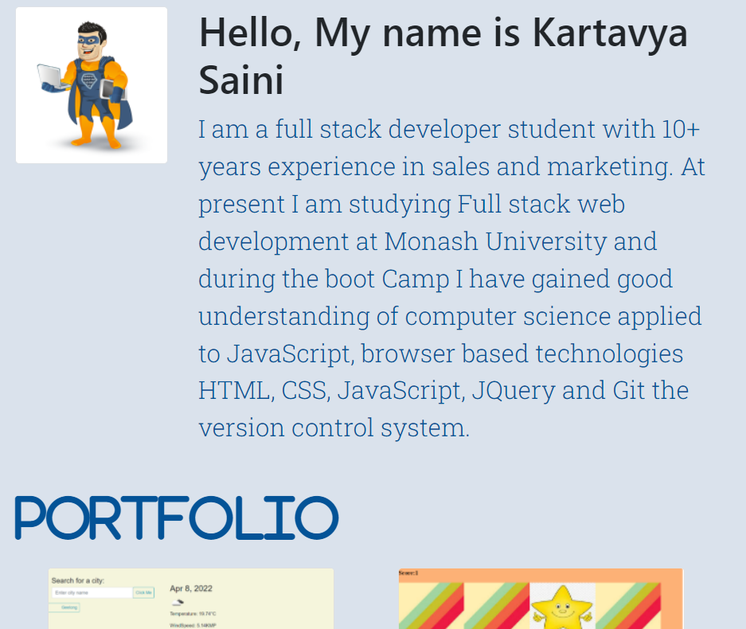
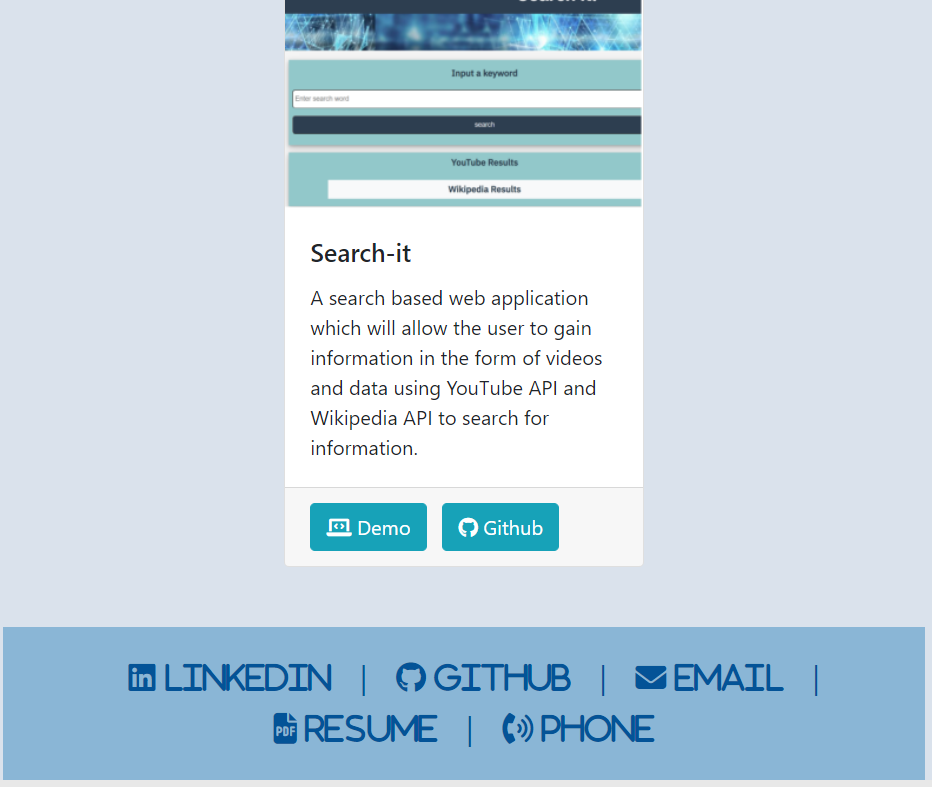

#  Updated MyPortfolio

Thi is an updated portfolio as part of building toward being employer-competitive.

# Features
* Displaying full name with contact information including email and phone number.
* Links to Github profile and Linkedin profile.
* Link to online resume.
* Project 1 and tow exemplary assignments including following.
     * Screenshot of the deployed applications.
     * Title
     * Link to the deployed version
     * Link to the GitHub repository.
* Polished, mobile-responsive user interface.

# Websites
* github : https://github.com/kartavya99/MyPortfolio.git
* Deployed : https://kartavya99.github.io/MyPortfolio/

# Screenshot

## Technologies and Libraries
### HTML
### CSS
### Bootstrap
